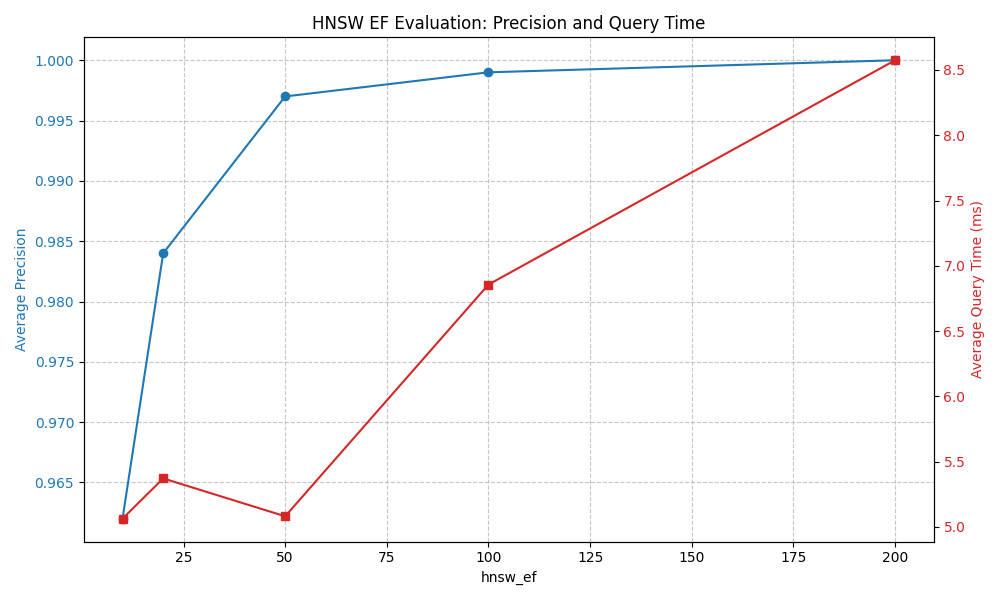

Increasing the exploration factor improved precision up to 100% at ef=200, but also increased the average query time.

Query time results varied a bit between different runs, but the overall trend remained the same. Here are the logged 
values and a plot for a single run:

```
Average exact query time: 88.92 ms
[
    {
        "hnsw_ef": 10,
        "avg_precision": 0.9620000000000001,
        "avg_query_time_ms": 5.06289005279541
    },
    {
        "hnsw_ef": 20,
        "avg_precision": 0.9840000000000001,
        "avg_query_time_ms": 5.371119976043701
    },
    {
        "hnsw_ef": 50,
        "avg_precision": 0.997,
        "avg_query_time_ms": 5.08098840713501
    },
    {
        "hnsw_ef": 100,
        "avg_precision": 0.9990000000000001,
        "avg_query_time_ms": 6.856276988983154
    },
    {
        "hnsw_ef": 200,
        "avg_precision": 1.0,
        "avg_query_time_ms": 8.574371337890625
    }
]
```



It appears that up to an ef=50, the increase in query time is negligible, while precision gains are still 
relatively large. This seems to be a sweet spot in this particular case in terms of tradeoff between precision and speed.
Beyond that point, computation time increases more significantly, and the precision gains are much smaller. Nevertheless, if 
exact results are needed, the query time for ef=200 was still about 8-10x faster than the exact search.

